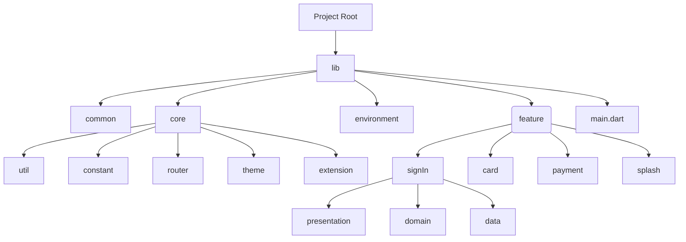
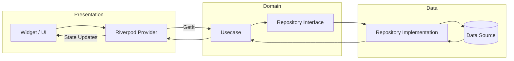

# payment_demo

https://github.com/user-attachments/assets/d98c28c0-f04c-4c8b-88fc-def3b02687ac

## Directory Structure

The following diagram outlines the project's main directories and feature modules.

## Architecture Overview

This diagram illustrates communication between layers and how state is managed with Riverpod and GetIt.

