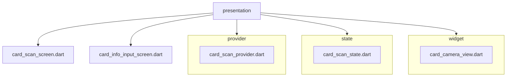

# 카드 스캔 프레젠테이션 레이어

이 디렉터리에는 카드 스캔 플로우에 사용되는 UI와 상태 관리 코드가 포함되어 있습니다.
모듈은 클린 아키텍처를 따르며, 프레젠테이션 레이어는 도메인 레이어에 의존하고
도메인 레이어는 데이터 레이어에 의존합니다.

## 디렉터리 구조

## 레이어 구성

- **presentation** → Riverpod 프로바이더와 Flutter 위젯을 사용하며
  `CardScanUsecase`를 통해 도메인 레이어와 통신합니다.
- **domain** → `CardScanEntity`, `CardScanRepository`, `CardScanUsecase`를 정의하며
  Flutter와의 의존성이 없습니다.
- **data** → 실제 데이터 처리 로직을 담은 `CardScanRepositoryImpl`을 구현합니다.
- 의존성 방향은 `presentation → domain → data` 순서이며
  `get_it`과 `injectable`을 통해 주입됩니다.

## card_scan_provider

`card_scan_provider`는 `@riverpod` 노티파이어로 `CardScanEntity` 상태를 보관합니다.
주요 기능은 다음과 같습니다.

- `updateCardScan` – 스캔된 카드 정보를 업데이트합니다.
- `resetCardScan` – 저장된 카드 정보를 초기화합니다.
- `submitCardScan` – 이미지 데이터를 서버에 업로드하고 결과를 반영합니다.

프로바이더는 자동 dispose 되며 테스트 시 오버라이드할 수 있습니다.
`get_it`에서 가져온 `CardScanUsecase`를 통해 도메인 레이어와 상호작용합니다.

## card_scan_screen

`CardScanScreen`은 카메라 미리보기를 제공하는 `CardCameraViewScreen`을 사용해
카드를 촬영하고, 촬영 결과를 `cardScanProvider`에 전달합니다.
성공적으로 스캔되면 `CardInfoInputScreen`으로 이동합니다.

## card_info_input_screen

`CardInfoInputScreen`은 스캔한 카드 정보를 사용자가 확인하고 수정할 수 있는 화면입니다.
필수 정보가 모두 입력되면 '카드 등록' 버튼이 활성화되어
앱의 홈 화면으로 이동합니다.
