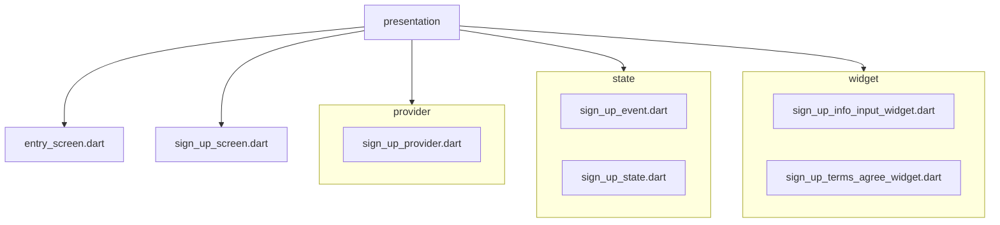

# 인증 프레젠테이션 레이어

이 디렉터리에는 인증 플로우에 사용되는 UI와 상태 관리 코드가 포함되어 있습니다.
모듈은 클린 아키텍처를 따르며, 프레젠테이션 레이어는 도메인 레이어에 의존하고
도메인 레이어는 데이터 레이어에 의존합니다.

## 디렉터리 구조

## 레이어 구성

- **presentation** → Riverpod 프로바이더와 Flutter 위젯을 사용하며
  `SignUpUsecase`를 통해 도메인 레이어와 통신합니다.
- **domain** → `SignUpFormEntity`, `SignUpRepository`, `SignUpUsecase`를 정의하며
  Flutter와의 의존성이 없습니다.
- **data** → 실제 데이터 처리 로직을 담은 `SignUpRepositoryImpl`을 구현합니다.
- 의존성 방향은 `presentation → domain → data` 순서이며
  `get_it`과 `injectable`을 통해 주입됩니다.

## sign_up_provider

`sign_up_provider`는 `@riverpod` 노티파이어로 `SignUpFormEntity` 상태를 보관합니다.
주요 기능은 다음과 같습니다.

- `setState` – 폼 상태를 업데이트합니다.
- `requestEmailCertification` – `SignUpUsecase`를 호출해 이메일 인증 코드를 요청합니다.
- `certifyEmailCode` – 입력한 인증 코드를 검증합니다.

프로바이더는 자동 dispose 되며 테스트 시 오버라이드할 수 있습니다.
`get_it`에서 가져온 `SignUpUsecase`를 통해 도메인 레이어와 상호작용합니다.

## sign_up_screen

`SignUpScreen`은 신규 회원 가입을 위한 UI를 구성합니다.
`SignUpInfoInput`과 `SignUpTermsAgreeWidget`을 사용해 정보를 입력받고
`signUpProvider`의 상태를 구독합니다.
폼이 유효할 때 하단의 `CustomButton`이 활성화됩니다.
